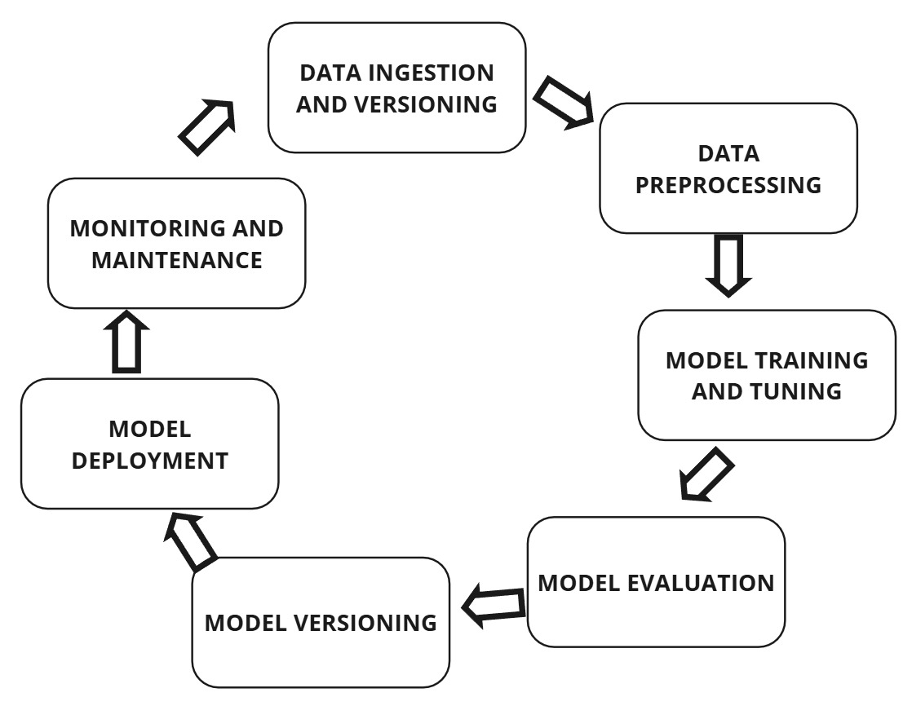
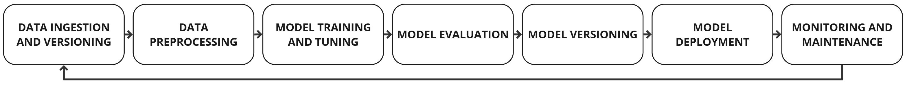

# Towards Measurable Ethics: A Framework for AI Ethical Compliance Metrics
*by Guilherme Palumbo*  
*PhD Candidate at University of Minho* 

The methodology consists of five sequential stages: (1) AI Lifecycle Stage Identification, (2) Tasks Definition, (3) Compliance List Development, (4) Compliance Checks Distribution, and (5) Metrics Creation. 
Each stage builds upon the previous one to form a comprehensive architecture capable of producing objective, interpretable, and quantifiable metrics based on ethical principles, focused on AI development best practices, the [EU AI Act](https://eur-lex.europa.eu/eli/reg/2024/1689/oj/eng) and the [Ethics Guidelines for Trustworthy AI](https://digital-strategy.ec.europa.eu/en/library/ethics-guidelines-trustworthy-ai).

## (1) AI Lifecycle Stage Identification

Seven stages were identified that capture the end-to-end lifecycle of AI system development (represented in the Figure below):

| Stage                       | Description                                                                                                                              |
|-----------------------------|------------------------------------------------------------------------------------------------------------------------------------------|
| **Data Ingestion and Versioning** | Collection and management of raw data, integrating it from various systems, and applying appropriate version control ensuring data traceability and reproducibility. |
| **Data Preprocessing**       | Cleaning, transforming, and preparing data for training. Tasks may include outlier removal, feature encoding, and handling missing values. |
| **Model Training and Tuning**| Learning algorithms are applied to data, and models are developed and trained. Tasks include hyperparameter optimization, regularization, and validation splits. |
| **Model Evaluation**         | Validating model performance using appropriate metrics.                                                                                  |
| **Model Versioning**         | As models are updated and retrained, versioning ensures changes are tracked and documented, managing different model versions.            |
| **Model Deployment**         | Integrating the model into production environments. This may involve wrapping models in APIs, ensuring infrastructure compatibility, and conducting deployment testing. |
| **Monitoring and Maintenance** | Ongoing observation and updates to the model post-deployment.                                                                            |

or

## (2) Tasks Definition

| Task Name | Description | Stage |
|-----------|-------------|-------|
| Data Collection | Gather raw data from databases, APIs, sensors, web scraping, user inputs, or other sources. | Data Ingestion & Versioning |
| Data Extraction | Retrieve data from structured (CSV, SQL) and unstructured (PDFs, images, text) sources. | Data Ingestion & Versioning |
| Data Integration | Merge data from multiple sources while resolving inconsistencies. | Data Ingestion & Versioning |
| Streaming Data Handling | Manage real-time ingestion from IoT devices, event-driven systems, or streaming platforms. | Data Ingestion & Versioning |
| Batch Data Handling | Process large amounts of data in scheduled or on-demand batches. | Data Ingestion & Versioning |

*Table continues... See the full table [here](./(2)%20tasks_definition/tasks_definition.md)*

## (3) Compliance List Development

| Task Name | Compliance Check | Compliance Description |
|-----------|------------------|------------------------|
| Data Collection | Raw Data Acquisition | Check if the code includes methods to collect raw data from databases, APIs, sensors, web scraping, or user inputs. |
| Data Extraction | Data Retrieval Implementation | Verify if the code includes logic to extract data from structured (CSV, SQL databases) and unstructured (PDFs, images, text) sources. |
| Data Integration | Multi-Source Data Merging | Assess whether the code includes functionality to merge multiple data sources while resolving inconsistencies. |
| Streaming Data Handling | Real-Time Data Ingestion | Determine if the code implements handling of real-time data streams from IoT devices, event-driven systems, or streaming platforms. |
| Batch Data Handling | Batch Processing Implementation | Check if the code supports batch processing mechanisms for large-scale data ingestion. |

*Table continues... See the full table [here](./(3)%20compliance_check_development/compliance_list.md)*

## (4) Compliance Checks Distribution

Example: Accountability Auditability

| Task Name | Compliance Check | Reasoning |
|-----------|------------------|-----------|
| Metadata Management | Metadata Storage and Tracking | Metadata management directly supports auditability by providing a clear, structured record of the data used in an AI system. This allows auditors to understand the sources, types, and characteristics of the data, which is crucial for assessing the fairness, accuracy, and reliability of the system. |
| Data Versioning | Version Control Implementation | Data versioning is essential for auditability as it allows for the tracking of changes made to the data over time. This is crucial for understanding how the AI system's performance and behavior may have been influenced by changes in the data. |
| Schema Validation | Schema Conformance Check | Schema validation ensures that the data adheres to a predefined schema, which is important for auditability. This allows auditors to understand the structure and format of the data, and to check that the data has been processed and used correctly. |
| Data Quality Checks | Consistency and Integrity Checks | Data quality checks are key to auditability as they ensure the integrity and consistency of the data. This allows auditors to assess the quality of the data and to understand any potential issues or biases that may affect the AI system's performance. |
| Performance Metric Calculation | Evaluation Metric Computation | The calculation of performance metrics allows auditors to assess the effectiveness and accuracy of the AI system. This is crucial for auditability as it provides a quantitative measure of the system's performance. |

*Table continues... See the all the reasoning [here](./(4)%20compliance_check_distribution/compliance_check_distribution_reasoning_markdown)*

| Task Name | Compliance Check | Compliance Description |
|-----------|------------------|------------------------|
| Metadata Management | Metadata Storage and Tracking | Verify if the code maintains structured metadata, including source details, timestamps, and schema definitions. |
| Data Versioning | Version Control Implementation | Ensure that the code implements dataset versioning to track different versions for reproducibility and rollback capabilities. |
| Schema Validation | Schema Conformance Check | Check if the code validates incoming data against predefined formats and structures to ensure compliance. |
| Data Quality Checks | Consistency and Integrity Checks | Assess whether the code includes checks to maintain data quality and consistency throughout preprocessing. |
| Performance Metric Calculation | Evaluation Metric Computation | Check if the code computes relevant metrics such as accuracy, precision, recall, F1-score for classification, or RMSE, MAE for regression. |

*Table continues... See the all the tables [here](./(4)%20compliance_check_distribution/markdown)*
